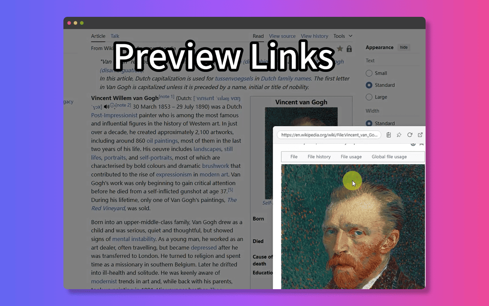

# Perché Aprire Troppe Schede Rallenta il Tuo Browser (e Come le Estensioni di Anteprima dei Link Possono Aiutare)

A chi non è capitato? Una finestra del browser strapiena di schede e, all'improvviso, tutto si blocca. Ma perché **aprire troppe schede rallenta così tanto il browser**?

La risposta è nelle risorse. Ogni scheda aperta, anche in background, consuma:

*   **RAM (Memoria):** I siti web hanno bisogno di memoria per archiviare dati, immagini e script. Più schede = maggiore utilizzo di memoria.
*   **CPU (Potenza di Calcolo):** Spesso le schede eseguono script in background (pubblicità, tracker, aggiornamenti) che utilizzano potenza di calcolo.

Quando queste risorse sono al limite, il browser fatica. Si verificano rallentamenti, mancata risposta e, a volte, anche blocchi. L'idea di **navigare più velocemente senza troppe schede** sembra un miraggio.

Quindi, come si combatte questa situazione senza rinunciare all'accesso alle informazioni?

Entrano in gioco le **estensioni di anteprima dei link**. Questi strumenti offrono una soluzione intelligente.

 <!-- Potrebbe essere difficile trovare un'immagine diretta per questo, utilizzo un concetto di segnaposto -->

Invece di caricare completamente ogni link in una nuova scheda, affamata di risorse, estensioni come NoTab ti permettono di **visualizzare l'anteprima dei link senza aprire nuove schede**. Recuperano solo le informazioni necessarie per mostrarti il contenuto in una sovrapposizione leggera.

Questo significa che puoi:

*   Controllare rapidamente i link senza aumentare il numero di schede.
*   **Risparmiare memoria riducendo significativamente le schede aperte**.
*   Mantenere il browser in esecuzione senza intoppi.

Utilizzare uno strumento di **anteprima dei link per il browser** è un modo diretto per **ridurre l'ingombro delle schede in Chrome** (o altri browser) e migliorare le prestazioni.

Smetti di lasciare che il sovraccarico di schede paralizzi la velocità del tuo browser.

Prova l'approccio efficiente con NoTab: [https://notab.wand.tools/](https://notab.wand.tools/)

Ti aiuta a gestire le informazioni senza compromettere le prestazioni del tuo browser.
