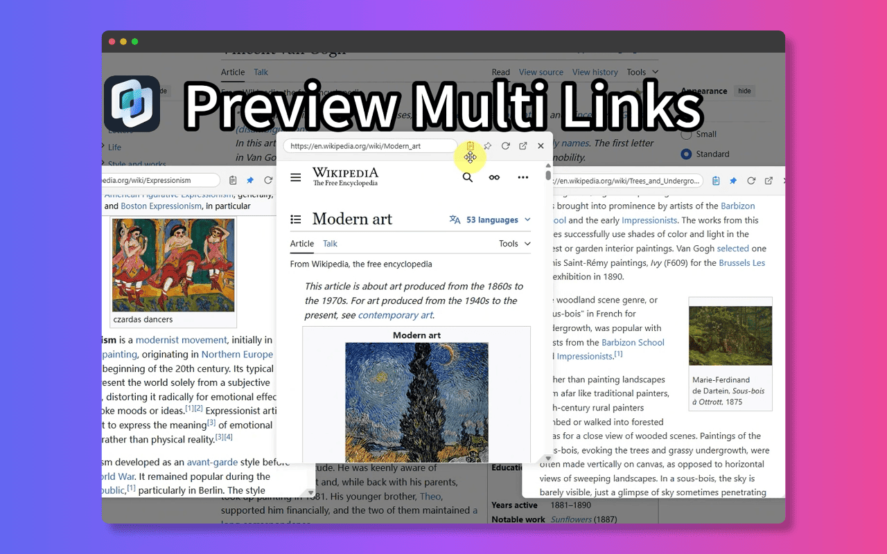
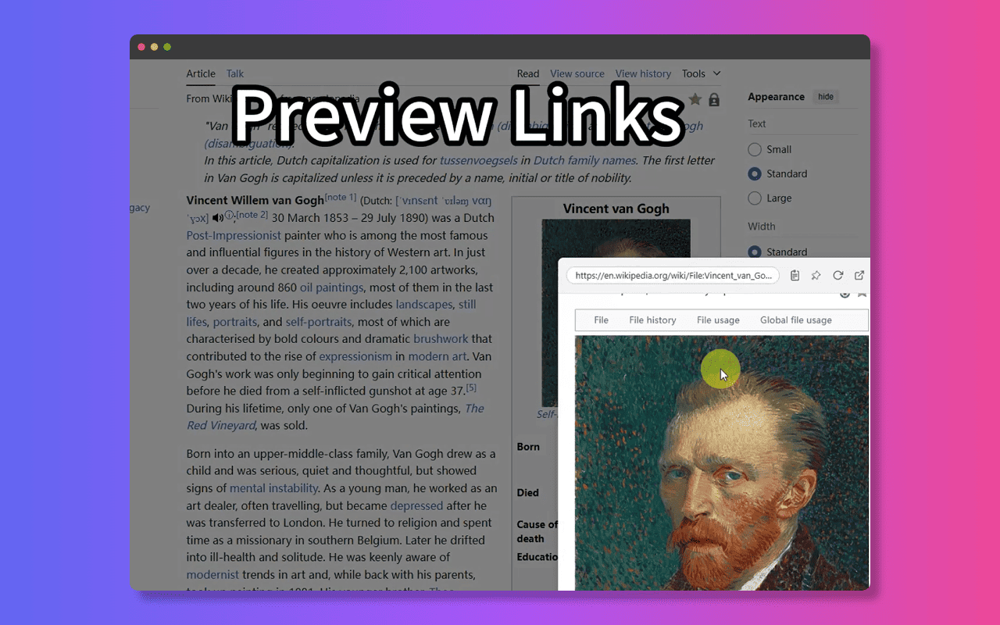

# 현재 페이지에서 링크 미리보기: 링크 미리보기 확장 프로그램으로 가장 쉽게 하는 방법

현재 읽고 있는 페이지를 벗어나지 않고 링크 내용을 확인하고 싶으신가요? 새 탭에서 열면 흐름이 끊깁니다. 해결책은 **현재 페이지에서 링크를 미리보는 방법**을 배우는 것이며, 가장 쉬운 방법은 **링크 미리보기 확장 프로그램**을 사용하는 것입니다.

복잡한 우회 방법은 잊으세요. 이러한 브라우저 애드온은 **인라인 링크 미리보기**를 위해 특별히 설계되었습니다.

사용 방법은 매우 간단합니다:
1.  링크 미리보기 확장 프로그램(예: NoTab)을 설치합니다.
2.  평소처럼 웹 서핑을 합니다.
3.  궁금한 링크를 발견하면 마우스를 올려 놓거나 확장 프로그램의 특정 트리거를 사용합니다.
4.  작은 창이 바로 그 자리에 나타나 연결된 페이지의 내용을 보여줍니다.

정말 간단하죠! 페이지 이동 없이 즉시 **링크 호버 미리보기**를 얻을 수 있습니다.

이것이 왜 그렇게 유용할까요?
*   **끊김 없는 읽기:** 주요 콘텐츠에 집중할 수 있습니다.
*   **빠른 맥락 파악:** 링크에서 즉시 정보를 얻을 수 있습니다.
*   **정리된 브라우징:** 불필요한 탭을 열지 않아 **브라우저 탭을 효율적으로 관리**할 수 있습니다.

NoTab은 제가 가장 추천하는 확장 프로그램입니다. **페이지를 벗어나지 않고 링크를 미리보기** 위한 부드럽고 사용자 정의 가능한 경험을 제공합니다. 미리보기 창 크기를 조정하고, 리더 모드를 사용하고, 그 이상을 할 수 있습니다.

현재 페이지에서 미리보기 기술을 마스터하고, **링크를 미리보기 위한 가장 간단한 Chrome 확장 프로그램**입니다.

링크 내용을 잠깐 보기 위해 탭을 전환하는 것을 멈추세요.

NoTab으로 현재 페이지에서 바로 미리보기를 시작하세요: [https://notab.wand.tools/](https://notab.wand.tools/)

브라우징 경험이 훨씬 더 매끄러워집니다.
